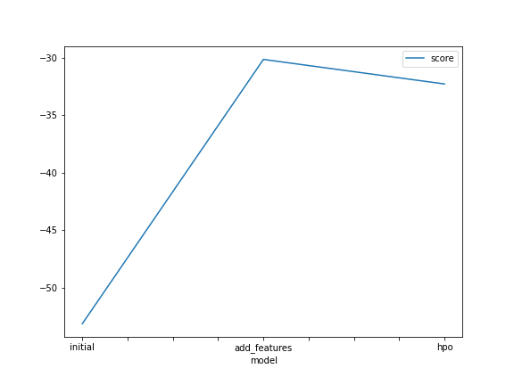
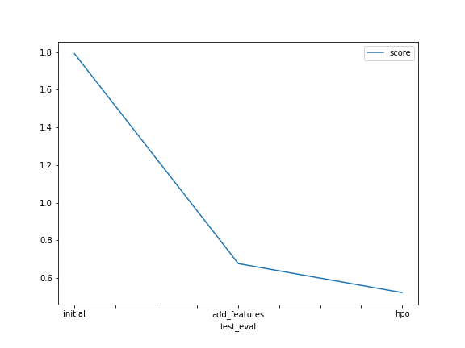

# Report: Predict Bike Sharing Demand with AutoGluon Solution
#### NAME HERE
Titilayo Amuwo
## Initial Training
### What did you realize when you tried to submit your predictions? What changes were needed to the output of the predictor to submit your results?
TODO: I noticed that Kaggle does not take negative predictions when submitting the files. In order to successfully submit the results, the predictions must not contain a negative value. 

### What was the top ranked model that performed?
TODO: The top ranked model that best performed was the LightGBMLarge_BAG_L1	-32.291402 that was hyper tuned with tabular autogluon. The LightGBMLarge_BAG_L1 with a rmse of -32.291402 performed very well on unseen data.

## Exploratory data analysis and feature creation
### What did the exploratory analysis find and how did you add additional features?
TODO: The first EDA we run on the train data shows that the season, workingday, holiday, and weather columns are categorical data. Also, the temp and atemp column are normal distribution with a bell curve while, humidity is negatively skewed. Coupled with that, windspeed and the label ('count') are both positively skewed which means that there are more positive values. The datetime column needs to be converted to datetime in order to view the summary per year, month, day and hours the demand of the bikes.

With that being said, we had to create new columns for the datetime, so that we can know the counts of bike demand per year, months, day and hour. Not only that, we also change the season and weather data type to categorical.

### How much better did your model preform after adding additional features and why do you think that is?
TODO: The LightGBMLarge_BAG_L1 model performed much better than the baseline model with a rmse score of -32.291402; which is 71% much better than the initial algorithm the fact that it was able to read the new features that was implemented 'year', month, day, hour, and 'season','weather' as a categorical to train the algorithms make it perform great on unseen test data. Also, when the LightGBMLarge_BAG_L1 was hypertuned with different params, it was able to search for a better LightGBMLarge_BAG_L1 model that fit the  unseen data.

## Hyper parameter tuning
### How much better did your model preform after trying different hyper parameters?
TODO: np.abs(0.52182 - 1.79197) / 1.79197 * 100
The LightGBMLarge_BAG_L1 perform 71% much better than the WeightedEnsemble_L3 with a root mean squared error of -32.291402

### If you were given more time with this dataset, where do you think you would spend more time?
TODO: I would spend more time working on exploratory analysis and hyperparameter tuning of the model. I believe that with more tuning the model can perform great.

### Create a table with the models you ran, the hyperparameters modified, and the kaggle score.
|model|hpo1|hpo2|hpo3|score|
|--|--|--|--|--|
|initial|timelimit =600|none|preset= best_quality|1.79197|
|add_features|timelimit =600|preset= best_quality|problem_type = regression|0.67601|
|hpo|timelimit =600|preset= best_quality|default_FTT|0.52182|

### Create a line plot showing the top model score for the three (or more) training runs during the project.

TODO: Replace the image below with your own.

### Create a line plot showing the top kaggle score for the three (or more) prediction submissions during the project.

TODO: Replace the image below with your own.

## Summary
TODO: Without feature engineering the algorithm was not performing well. So we performed a feature engineering on the dataset to give us more features to use for the training of the algorithm. After generating more features, we then classify the data into the right data types. Finally, the LightGBMLarge_BAG_L1 algorithm was able to perform great on unseen data. In conclusion, the more we perform feature engineering, and hyper tuning on the algorithm, the better the performance on unseen data.
